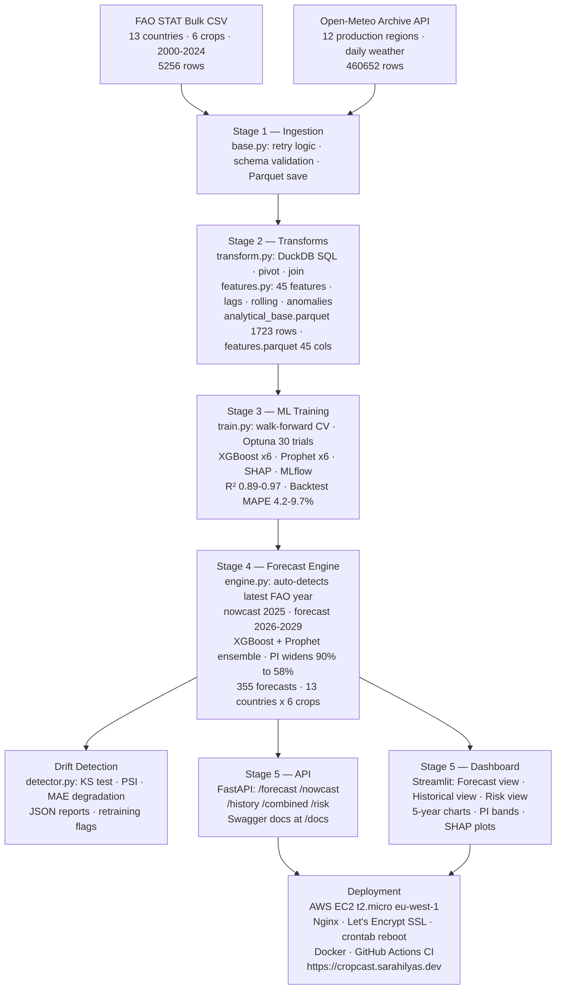

# CropCast

A production ML platform for global crop yield forecasting. Nowcasts the current unreported year and forecasts 5 years ahead across 13 countries and 6 crops — rolling forward automatically when new FAO data is released.

**Live:** [cropcast.sarahilyas.dev](https://cropcast.sarahilyas.dev)

[](https://github.com/sarah0ilyas/Cropcast/actions)


---

## The problem

FAO publishes crop production data 12–18 months after the fact. By the time 2025 yield figures are officially released, it'll be late 2026. For procurement teams and supply chain analysts, that lag is unusable.

CropCast solves this with a two-layer approach: a **nowcast** that estimates the current unreported year using lag features and real-time weather, and a **5-year forward forecast** with prediction intervals that widen honestly over time.

The forecast window is fully dynamic — when new FAO data lands, the pipeline auto-detects the latest year and shifts the horizon forward without any manual changes.

---

## Pipeline



---

## Model results

| Crop | R² | Backtest MAPE | Backtest MAE |
|---|---|---|---|
| Grapes | 0.9724 | 6.4% | 0.83 MT/HA |
| Strawberries | 0.9632 | 9.6% | 2.47 MT/HA |
| Tomatoes | 0.9459 | 4.2% | 4.00 MT/HA |
| Citrus | 0.9412 | 4.4% | 0.83 MT/HA |
| Avocados | 0.9056 | 5.9% | 0.41 MT/HA |
| Blueberries | 0.8920 | 7.6% | 1.12 MT/HA |

Backtest MAPE reflects out-of-sample performance on genuinely future years — not a held-out slice of the same dataset.

---

## Key engineering decisions

**Why temporal CV instead of random splits?**
Random splits leak future yield data into training, artificially inflating metrics. In production you always predict forward in time — the evaluation must mirror that.

**Why XGBoost + Prophet ensemble?**
XGBoost captures non-linear feature interactions and dominates short-horizon predictions. Prophet handles long-term trend extrapolation better for years 4–5. The ensemble weight shifts from XGBoost-dominant (year 1) toward Prophet (year 5) as uncertainty grows.

**Why DuckDB over Spark?**
At under 200K rows, Spark adds infrastructure overhead with no performance benefit. DuckDB executes columnar SQL in-memory in under a second with zero setup.

**Why nowcast instead of just forecast?**
FAO data lags 12–18 months. The nowcast estimates the current unreported year using 2024 lag features and 2025–2026 weather observations — genuinely useful for procurement teams who cannot wait 18 months for official statistics.

**Why rolling forecast horizon?**
The forecast window auto-advances when new FAO data is ingested. No hardcoded years anywhere — `latest_year = df["year"].max()` drives everything downstream.

---

## Data sources

| Source | Coverage | Records |
|---|---|---|
| FAO STAT bulk CSV | 13 countries, 6 crops, 2000–2024 | 5,256 rows |
| Open-Meteo archive | 12 production regions, daily 2000–2026 | 460,652 rows |

**Total: 465,908 rows of real agricultural data**

---

## Stack

Python 3.11, DuckDB, XGBoost, Prophet, Scikit-learn, Optuna, MLflow, SHAP, FastAPI, Streamlit, Plotly, SciPy, PyArrow, AWS EC2, Nginx, Docker, GitHub Actions.

---

## Quickstart

```bash
git clone https://github.com/sarah0ilyas/Cropcast.git
cd Cropcast
python3 -m venv .venv && source .venv/bin/activate
pip install -r requirements.txt
export PYTHONPATH=$(pwd)

# Download FAO bulk CSV from FAO STAT first, then:
python3 cropcast/ingestion/weather_ingester.py
python3 cropcast/transforms/transform.py
python3 cropcast/transforms/features.py
python3 cropcast/models/train.py --trials 30
python3 cropcast/forecast/engine.py

streamlit run cropcast/dashboard/app.py
uvicorn cropcast.api.main:app --reload --port 8000
```

---

## Structure

```
cropcast/
  config/settings.py           15 countries, 6 crops, all thresholds
  ingestion/
    base.py                    Retry, validation, Parquet save
    fao_ingester.py            FAO bulk CSV connector
    weather_ingester.py        Open-Meteo connector
  transforms/
    transform.py               DuckDB cleaning and joining
    features.py                45 engineered features
  models/
    train.py                   XGBoost + walk-forward + SHAP + MLflow
    saved/                     6 trained models
    plots/                     SHAP importance plots
  forecast/
    engine.py                  Rolling 5-year ensemble forecast
  drift/
    detector.py                KS + PSI + MAE drift detection
  api/
    main.py                    FastAPI app
    routers/forecast_router.py
  dashboard/
    app.py                     Streamlit UI
```

---

Built by [Sarah Ilyas](https://github.com/sarah0ilyas) — Data Scientist/ML engineer 
